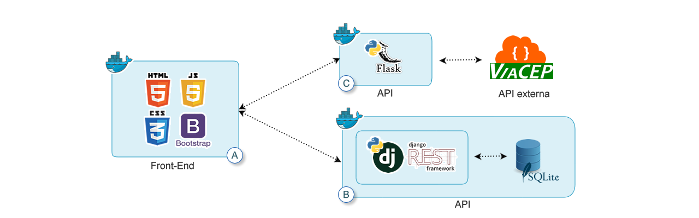

<h1 align="center">
    
</h1>


<p align="center">
 <a href="#sobre-o-projeto">Sobre</a> •
 <a href="#arquitetura">Arquitetura</a> • 
 <a href="#modo-de-desenvolvimento">Como executar</a> • 
 <a href="#tecnologias">Tecnologias</a> • 
 <a href="#autor">Autor</a> • 
 <a href="#licença">Licença</a>
</p>


<h4 align="center"> 
	Em desenvolvimento
</h4>

## Sobre o projeto

O projeto tem como finalidade centralizar informações sobre hemocentros, coletas e doadores. Permitindo o cadastro de hemocentros, doações, doadores e possíveis doadores. Visualize os dados em um dashboard que mostra unidades doadas no dia, comparação de crescimento de possíveis doadores cadastrados e doadores que já realizaram doações, comparação entre estoque ideal de unidades de sangue e estoque real de unidades, número de doçãoes por dia de cada tipo sanguíneo. Os dados podem ser visualizados por hemocentro, por estado ou todo o país (todos os hemocentros cadastrados). 

Busque doadores cadastrados no sistema próximos aos hemocentros ou próximo a um endereço informado (PCM - ponto de coleta móvel). Selecione o hemocentro (ou PCM), informe a distância (Km) e escolha ação a ser realizada: enviar e-mail, enviar SMS ou enviar mensagem via Whatsapp/Telegram


Projeto desenvolvido para atender ao MVP da disciplina de Desenvolvimento Full Stack Avançado (PUC-RIO).


⚠️ Este projeto é divido em três partes, conforme <a href="#arquitetura">Arquitetura</a> mostrada abaixo.<br/>
Acesse o [Readme](https://github.com/leoaguiar07/hemo_front_mvp_av) para visualizar todos os detalhes.


---

##  Arquitetura


<h1 align="center">
    
</h1>

Este projeto é divido em três partes:
1. Frontend (A) ([Readme](https://github.com/leoaguiar07/hemo_front_mvp_av))
2. API (B) ([Readme](https://github.com/leoaguiar07/hemo_api_mvp_av))
3. API (C) 


💡 O Frontend precisa que as APIs (B e C) estejam sendo executadas para funcionar perfeitamente.

---

### Pré-requisitos

Certifique-se de ter o [Docker](https://docs.docker.com/engine/install/) instalado e em execução em sua máquina.


---

## Como executar o projeto (API (C))

### Modo de desenvolvimento

Será necessário ter todas as libs python listadas no `requirements.txt` instaladas.
Após clonar o repositório, é necessário ir ao diretório raiz, pelo terminal, para poder executar os comandos descritos abaixo.

> É fortemente indicado o uso de ambientes virtuais do tipo [virtualenv](https://virtualenv.pypa.io/en/latest/installation.html).

```
(env)$ pip install -r requirements.txt
```

Este comando instala as dependências/bibliotecas, descritas no arquivo `requirements.txt`.


#### Executando o servidor


Para executar a API  basta executar:

```
(env)$ flask run --host 0.0.0.0 --port 5000
```

Em modo de desenvolvimento é recomendado executar utilizando o parâmetro reload, que reiniciará o servidor
automaticamente após uma mudança no código fonte. 

```
(env)$ flask run --host 0.0.0.0 --port 5000 --reload
```

#### Acesso no browser

Abra o [http://localhost:5000/#/](http://localhost:5000/#/) no navegador para verificar o status da API em execução.

---
### Através do Docker

Certifique-se de ter o [Docker](https://docs.docker.com/engine/install/) instalado e em execução em sua máquina.

Navegue até o diretório que contém o Dockerfile e o requirements.txt no terminal.
Execute **como administrador** o seguinte comando para construir a imagem Docker:

```
$ docker build -t nome_da_sua_imagem .
```

Uma vez criada a imagem, para executar o container basta executar, **como administrador**, seguinte o comando:

```
$ docker run -p 5000:5000 nome_da_sua_imagem
```

Uma vez executando, para acessar a API, basta abrir o [http://localhost:5000/#/](http://localhost:5000/#/) no navegador.


💡 O Frontend precisa que as APIs (B e C) estejam sendo executadas para funcionar perfeitamente.

---

##  Tecnologias

As seguintes ferramentas foram usadas na construção do projeto:

#### **Frontend (A)**  

[](https://skillicons.dev)

#### **API (B)**  

[](https://skillicons.dev)


#### **API (C)**  

[](https://skillicons.dev)

#### **Utilitários**


-   API:  **[ViaCep API](https://https://viacep.com.br/)**
-   Editor:  **[Visual Studio Code](https://code.visualstudio.com/)**
-   Teste de API:  **[Postman](https://www.postman.com/)**

---

## Autor

 
 <br />
 <sub><b>Léo Aguiar</b></sub></a> 
 <br /><br />


[](mailto:leorodriguesaguiar@gmail.com)

---

## Licença

Este projeto esta sobe a licença [MIT](./LICENSE).

Feito por Léo Aguiar [Entre em contato!](mailto:leorodriguesaguiar@gmail.com)
